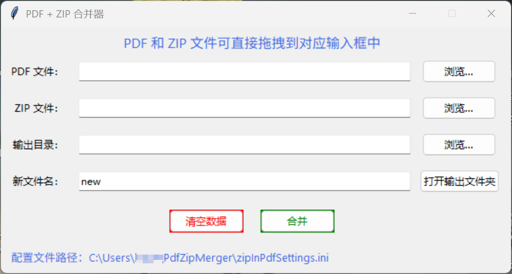
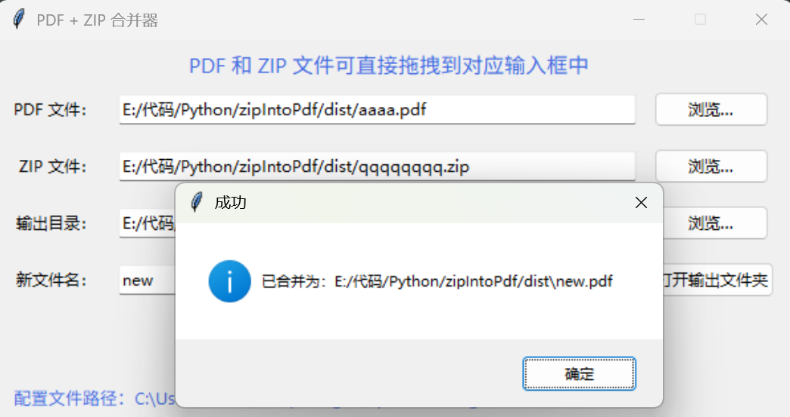
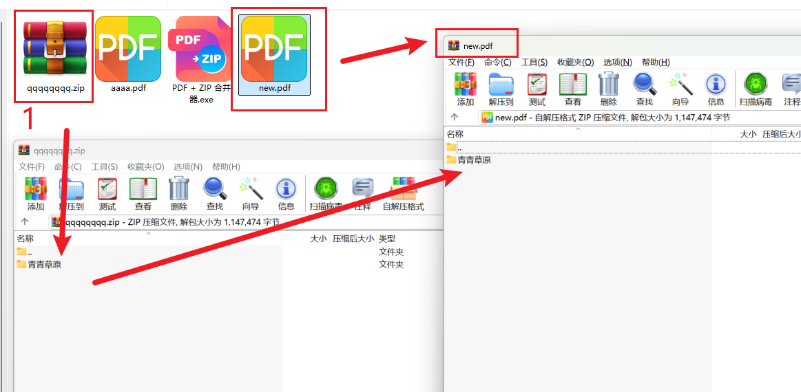

# zip_in_pdf
PDF + ZIP 合并器：把ZIP文件打包至PDF文件中

pdf新文件会自动重命名，如new,new1,new2...

图标文件：

&nbsp;

<strong>PYTHON直接运行，直接复制下面代码即可</strong>

&nbsp;

使用&nbsp;<strong>pyinstaller&nbsp;</strong>打包成单文件时需要添加<strong>&nbsp;hook-tkinterdnd2.py</strong>&nbsp;&nbsp;，与上面代码&nbsp;<strong>run.py&nbsp;</strong>在同级目录即可，<strong>cmd&nbsp;</strong>打包命令如下

<pre class="language-python highlighter-hljs"><code>pyinstaller -F -w -n="PDF + ZIP 合并器" --icon=a.ico run.py --additional-hooks-dir=.</code></pre>

&nbsp;

<strong>hook-tkinterdnd2.py</strong>&nbsp;代码如下

<pre class="language-python highlighter-hljs"><code>from PyInstaller.utils.hooks import collect_data_files
datas = collect_data_files('tkinterdnd2')</code></pre>

&nbsp;

成品链接  <a  style="color: #ff0000;" rel="noopener" target="_blank" href="./img/PDF + ZIP 合并器.exe">PDF + ZIP 合并器.exe</a> 

&nbsp;

